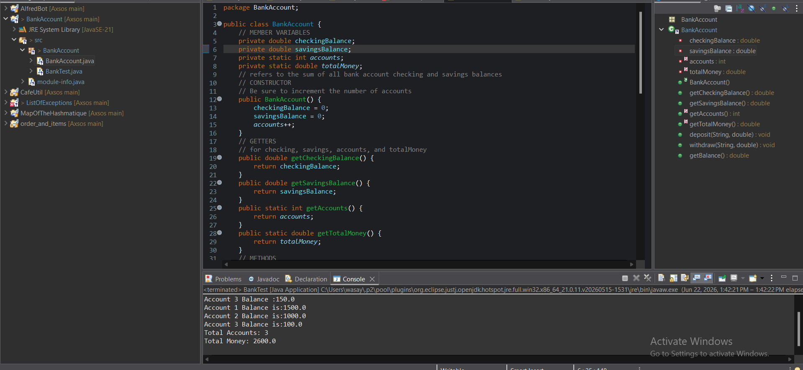

# Bank Account

## Description

This project simulates a simple bank account system using Java OOP concepts.

Each bank account contains:

* Checking Balance
* Savings Balance

The application allows users to:

* Deposit money into checking or savings accounts
* Withdraw money from checking or savings accounts
* View account balances
* Track the total number of bank accounts created
* Track the total amount of money stored across all accounts

---

## Technologies Used

* Java
* Object-Oriented Programming (OOP)

---

## Files

### BankAccount.java

Contains:

* Member variables
* Constructor
* Getters
* Deposit method
* Withdraw method
* Balance method

### BankTest.java

Used to test:

* Account creation
* Deposits
* Withdrawals
* Static variables

---

## Features

### Deposit

Users can deposit money into:

* Checking Account
* Savings Account

### Withdraw

Users can withdraw money from:

* Checking Account
* Savings Account

The system prevents withdrawals when funds are insufficient.

### Account Balance

Displays the total balance of a bank account.

### Static Tracking

Tracks:

* Total number of accounts
* Total money across all accounts

---

## Example Output

Account 1 Balance: 2500.0

Account 2 Balance: 1300.0

Account 3 Balance: 150.0

Account 1 Balance After Withdraw: 2300.0

Account 2 Balance After Withdraw: 1200.0

Account 3 Balance After Withdraw: 100.0

Total Accounts: 3

Total Money: 3600.0

---
## Project Screenshot

---

## Author

Jalil Wasaya

