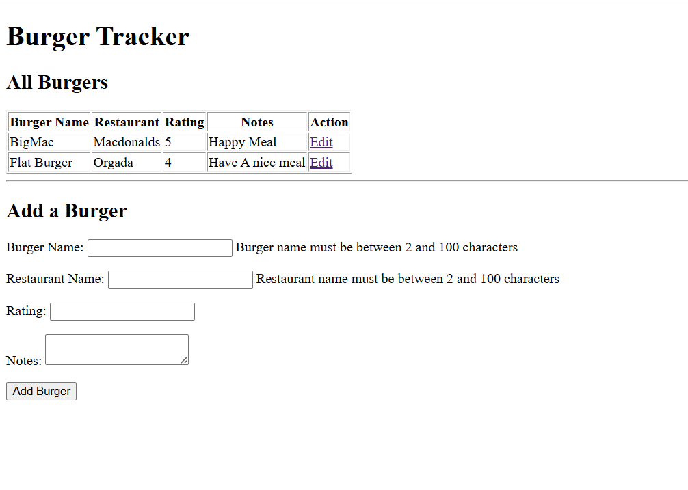
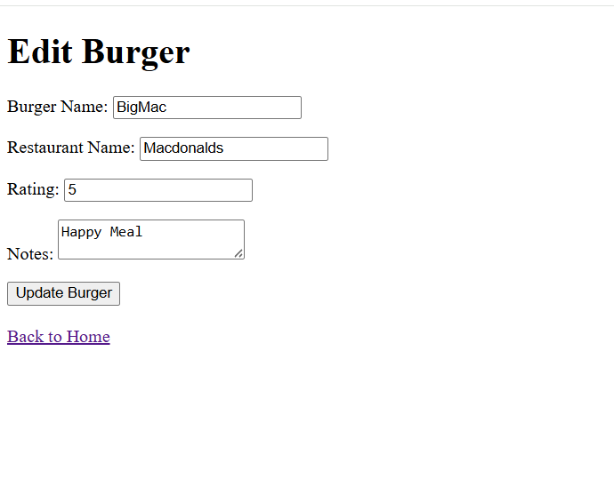

# 🍔 Burger Tracker

A simple **Java Spring Boot CRUD application** that allows users to keep track of their favorite burgers. Users can add new burgers, view all entries, and update existing burger information.

---

## 🚀 Features

* ✅ Add a new burger
* ✅ View all burgers
* ✅ Update existing burger information
* ✅ Form validation
* ✅ Store data in a MySQL database
* ✅ Spring MVC architecture (Controller, Service, Repository, Model)

---

## 🛠️ Technologies Used

* Java 17
* Spring Boot
* Spring MVC
* Spring Data JPA
* Hibernate
* MySQL
* JSP
* JSTL
* Bootstrap (optional)

---

## 📁 Project Structure

```
src
├── controllers
│   └── BurgerController.java
├── models
│   └── Burger.java
├── repositories
│   └── BurgerRepository.java
├── services
│   └── BurgerService.java
└── webapp
    └── WEB-INF
        ├── index.jsp
        └── edit.jsp
```

---

## ⚙️ Installation

1. Clone the repository

```bash
git clone https://github.com/your-username/BurgerTracker.git
```

2. Create a MySQL database

```sql
CREATE DATABASE burgerdb;
```

3. Update your `application.properties`

```properties
spring.datasource.url=jdbc:mysql://localhost:3306/burgerdb
spring.datasource.username=root
spring.datasource.password=your_password

spring.jpa.hibernate.ddl-auto=update
```

4. Run the project.

5. Open your browser:

```
http://localhost:8080
```

---

## 📸 Screenshots

### Home Page



---

### Edit Burger



---

## 🗄️ Database Fields

| Field           | Description                   |
| --------------- | ----------------------------- |
| Burger Name     | Name of the burger            |
| Restaurant Name | Restaurant serving the burger |
| Rating          | Rating from 1 to 5            |
| Notes           | Additional comments           |

---

## 📚 What I Learned

* Spring Boot project structure
* MVC Design Pattern
* Dependency Injection
* CRUD Operations
* Spring Data JPA
* MySQL Integration
* Form Validation using `@Valid`
* `@ModelAttribute`
* `BindingResult`
* `@PathVariable`
* JSP Form Tags
* Redirect After POST Pattern

---

## 🔮 Future Improvements

* Delete burgers
* Burger details page
* Search burgers
* Sort by rating
* User authentication
* Responsive UI with Bootstrap

---

## 👨‍💻 Author

**Jalil Wasaya**

---

### 📂 GitHub Repository Structure

```
BurgerTracker
│── src
│── pom.xml
│── README.md
│── LandPage.png
│── Edit.png
```


