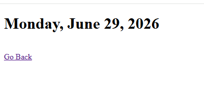
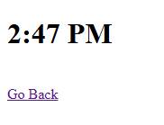

# Display Date

A simple Spring Boot MVC application that displays the current date and current time using JSP, JSTL, CSS, and JavaScript.

## Features

- Dashboard page with navigation links.
- Displays the current date.
- Displays the current time.
- Uses JSTL `<fmt:formatDate>` for formatting.
- External CSS for styling.
- External JavaScript for page alerts.

## Technologies Used

- Java 17
- Spring Boot
- Spring MVC
- JSP
- JSTL
- HTML
- CSS
- JavaScript
- Maven

## Screenshots

### Current Date

### Current Time

## Routes

| URL | Description |
|------|-------------|
| `/` | Dashboard |
| `/date` | Displays the current date |
| `/time` | Displays the current time |

## Author

**Jalil Wasaya**