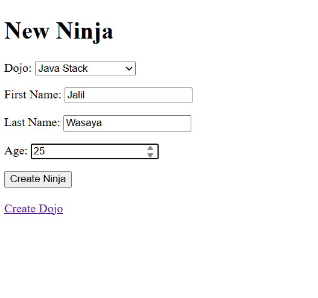
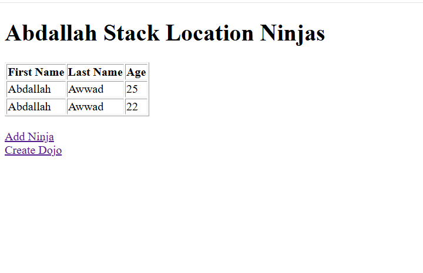

# Dojo & Ninja

## Overview

This project is a Spring Boot MVC application that demonstrates a
**One-to-Many** relationship using JPA and Hibernate.

-   A **Dojo** can have many **Ninjas**.
-   A **Ninja** belongs to one **Dojo**.

------------------------------------------------------------------------

## Features

-   Create a new Dojo
-   Create a new Ninja
-   Select a Dojo from a dropdown when creating a Ninja
-   View all Ninjas that belong to a specific Dojo
-   Server-side validation using Jakarta Validation
-   Spring MVC + JSP + JSTL + MySQL

------------------------------------------------------------------------

## Technologies

-   Java 17
-   Spring Boot
-   Spring MVC
-   Spring Data JPA
-   Hibernate
-   MySQL
-   JSP
-   JSTL
-   Maven

------------------------------------------------------------------------

## Database Relationship

    Dojo (1)
       |
       |------< Ninja (Many)

The `dojo_id` foreign key in the `ninjas` table links each Ninja to its
Dojo.

------------------------------------------------------------------------

## Application Screenshots

### 1. Create Dojo


------------------------------------------------------------------------

### 2. Create Ninja



------------------------------------------------------------------------

### 3. Show Dojo and Ninjas



------------------------------------------------------------------------

## Project Structure

    controllers/
    models/
    repositories/
    services/
    WEB-INF/

------------------------------------------------------------------------

## How to Run

1.  Create a MySQL database.
2.  Configure `application.properties`.
3.  Run the Spring Boot application.
4.  Open:

```{=html}
<!-- -->
```
    http://localhost:8080/

------------------------------------------------------------------------

## Learning Objectives

-   One-to-Many JPA relationships
-   Dependency Injection
-   MVC Architecture
-   CRUD operations
-   Form Validation
-   ModelAttribute
-   PathVariable
-   JSP Forms
