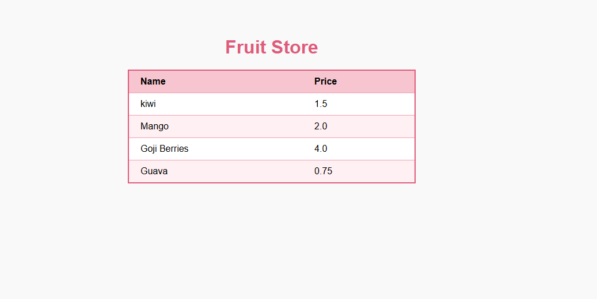

# 🍎 Fruit Store

A simple Spring Boot MVC application that displays a list of fruits and their prices using **JSP**, **JSTL**, and the **`<c:forEach>`** loop.

## 📌 Description

This project demonstrates how to:

- Create a Spring Boot MVC application.
- Pass a list of fruit objects from the controller to a JSP page.
- Iterate through the list using JSTL's `<c:forEach>`.
- Display dynamic data in an HTML table.

## 🛠️ Technologies Used

- Java
- Spring Boot
- Spring MVC
- JSP
- JSTL
- Maven
- HTML
- CSS

## 📂 Project Structure

```
src
├── main
│   ├── java
│   │   └── controller
│   ├── resources
│   └── webapp
│       └── WEB-INF
│           └── fruits.jsp
```

## 🚀 Features

- Display a dynamic fruit list.
- Show each fruit's name and price.
- Use JSTL `<c:forEach>` to render table rows.
- Clean and responsive table design.

## 📸 Screenshot



## ▶️ How to Run

1. Clone the repository.

```bash
git clone https://github.com/your-username/Fruit-Store.git
```

2. Open the project in **Spring Tool Suite (STS)** or **Eclipse**.

3. Update Maven dependencies.

4. Run the Spring Boot application.

5. Open your browser and visit:

```
http://localhost:8080/
```

## 📖 Learning Objectives

- Spring MVC Controllers
- Model Attributes
- JSP Views
- JSTL Core Tags
- `<c:forEach>`
- `<c:out>`
- Dynamic Data Rendering

---

**Created as part of the AXSOS Academy Java Spring Boot course.**