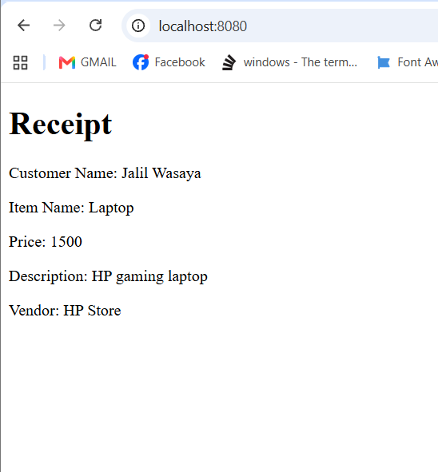

# Receipt Assignment

## Overview
This project is a Spring Boot web application that demonstrates the MVC (Model-View-Controller) architecture by rendering a purchase receipt using JavaServer Pages (JSP). The controller passes purchase information to the view, and the JSP displays it using JSTL.

## Technologies Used
- Java 17
- Spring Boot
- Spring MVC
- JSP
- JSTL
- Maven
- Eclipse / Spring Tool Suite (STS)

## Features
- Uses `@Controller` to render a JSP page.
- Passes data from the controller to the JSP using the Model.
- Displays customer name, item name, price, description, and vendor.
- Uses JSTL `<c:out>` tags to display dynamic data safely.

## Project Structure

```text
Receipt
│
├── src
│   └── main
│       ├── java
│       ├── resources
│       └── webapp
│           └── WEB-INF
│               └── index.jsp
├── pom.xml
└── README.md
```

## How to Run

1. Run the project as a Spring Boot App.
2. Open your browser.
3. Visit:

```
http://localhost:8080/
```

## Application Screenshot



## Learning Objectives

- Understand the MVC architecture.
- Create Spring MVC controllers.
- Pass data to a JSP using the Model.
- Render dynamic JSP pages.
- Use JSTL to display dynamic values.

## Author

**Jalil Wasaya**  
AXSOS Academy – Java Spring Boot